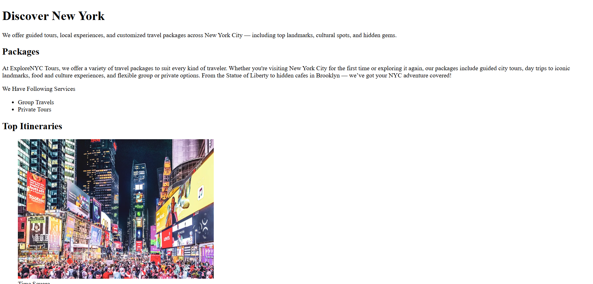

# 🗽 NYC Travel Agency - ExploreNYC Tours

A beginner-friendly static website for a fictional New York City travel agency, built using HTML and CSS. This project helped me practice webpage layout, sections, images, and basic styling while creating a real-world travel experience.

## 🌟 Features
- Travel packages description
- Tour cards (Times Square,Manhattan,Brooklyn Bridge etc.)
- Responsive layout (basic)

## 📸 Preview
 

## 🚀 Live Site
[Visit Website]([https://codewithSam025.github.io/nyc-travel-agency])

## 🛠️ Tech Used
- HTML
- CSS
- GitHub Pages for hosting

## 📌 What I Learned
- Structuring a multi-section webpage
- Writing semantic HTML
- Basic responsive design
- Hosting with GitHub Pages

---

Feel free to give feedback or suggest improvements. I'm learning and building step by step!
